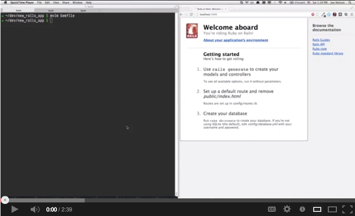
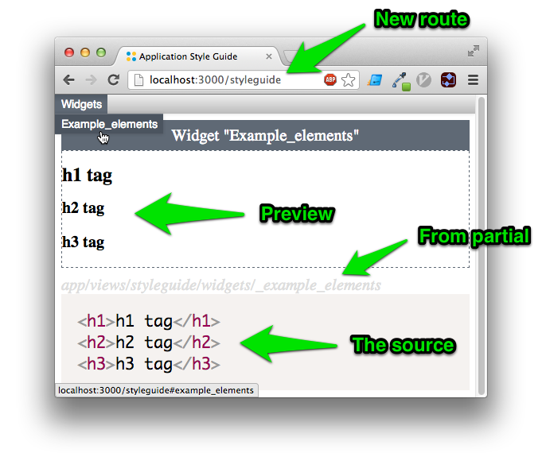

Adds a [living style
guide](http://24ways.org/2011/front-end-style-guides/) to your Rails
application with one command.

  

If you don't use a CSS style guide yet, here's why you should start:

* __It Makes Testing Easier.__ With all your styles in one place you can easily
check for browser bugs, resizing issues, text zoom issues, and printable
style. Putting examples of all styles in one place means you don't have to
reproduce application states to see error messages etc.
* __It Unifies Design.__ Designing shared components all at once fights the
temptation to have one-off page styles. This increases the coherence of
your design, making it less likely that styles drift between pages. It
also encourages cleaner markup.
* __It Standardizes Vocabulary.__ Style guides list all your widgets along with
names you have chosen. By referring to the guide, your team can settle
on common vocabulary for parts of the page. (e.g. "What does my team
call this thing on the front page, a slider, a carousel, a flipper, or
what?")
* __It Promotes Excellent Markup.__ The styleguide contains examples of your
desired canonical markup for various elements. Nobody needs to guess how
to create a menu or a form. Also your best front-end engineers can write
the markup and teach good habits.

## Usage

Add this gem to your Rails Gemfile:

    gem 'styleguide_rails'

Run `bundle`, and execute the styleguide generator:

    rails generate styleguide:install

That's it, you're done, you have a styleguide available at
`http://yourapp.com/styleguide`. If you visit that path you'll see there
is an example widget already created:

  

To add a new widget, run

    rails generate styleguide:widget NAME

which will create a partial in `app/views/styleguide/widgets` and it
will appear in the style guide. These partials support templating
languages like Haml if you have the gems installed.

## Live Reloading

Styleguide Rails can reload your browser whenever you change a CSS file
or a widget. This instant feedback is helpful for adjusting the styles.
To enable live reloading,

* Install the [LiveReload](https://chrome.google.com/webstore/detail/livereload/jnihajbhpnppcggbcgedagnkighmdlei?hl=en)
  plugin for Google Chrome.
* Add `gem 'guard'` and `gem 'guard-livereload', '~> 2.4', require: false` to your `Gemfile`
* Run `bundle`
* Run `guard` in a new terminal window
* Be sure you enable the LiveReload plugin in Chrome. Just click its
  icon.

## Credits

Thanks to project
[contributors](https://github.com/begriffs/styleguide_rails/contributors),
and to [Adam Braus](https://github.com/ajbraus) for suggesting the
idea for this gem.

## Upgrading

To overwrite an installation of an earlier version, run

    bundle update --source styleguide_rails
    rails generate styleguide:install -f

Don't worry, this will preserve any existing widgets.

## License

Styleguide_rails is Copyright © 2012 - 2013 Joe Nelson. It is free
software, and may be redistributed under the terms specified in the
LICENSE file.
